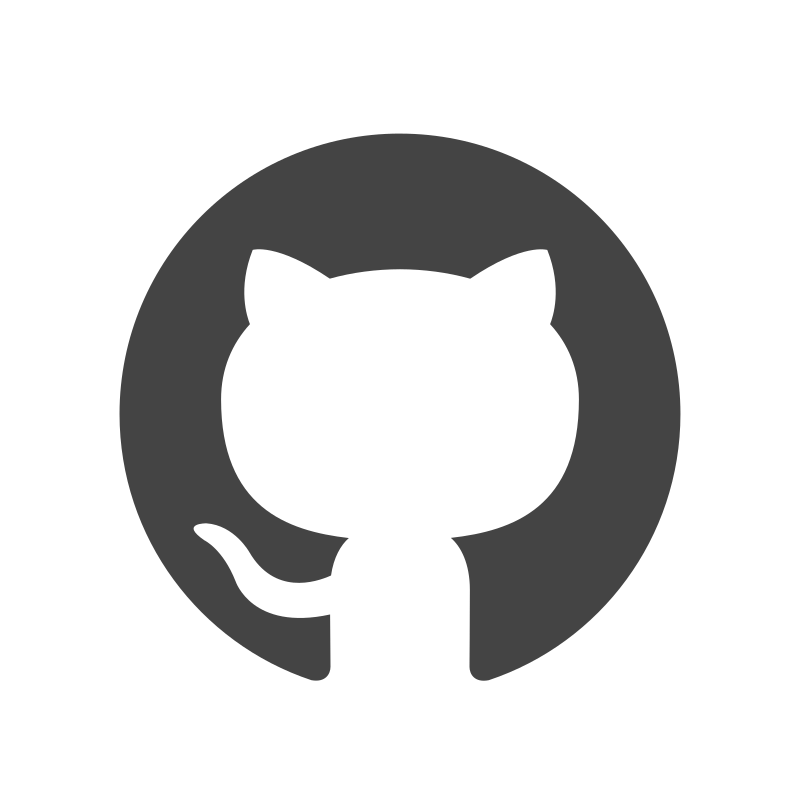

<a href="https://ru.wikipedia.org/ ">  
<h2 >Проект по автоматизации тестирования мобильного приложения <a href="https://ru.wikipedia.org/ "> Wikipedia </a></h2> 

## Содержание:

- Технологии и инструменты
- Список проверок, реализованных в тестах
- Запуск тестов (сборка в Jenkins) и из терминала
- Allure-отчет
- Уведомление в Telegram о результатах прогона тестов
- Видео пример прохождения тестов

<a id="tools"></a>
## Технологии и инструменты:

<p align="center">
  <a href="https://www.java.com/"></a>
  <a href="https://www.jetbrains.com/idea/"></a>
  <a href="https://github.com/"></a>
  <a href="https://junit.org/junit5/"></a>
  <a href="https://gradle.org/"></a>
  <a href="https://qameta.io/"></a>
  <a href="https://www.jenkins.io/"></a>
  <a href="https://web.telegram.org/"></a>
  <a href="https://ru.selenide.org/"></a>
  <a href="https://www.browserstack.com/"></a>
</p>

<a id="cases"></a>
## Реализованные проверки:
- Поиск статьи
- Открытие статьи из результатов поиска
- Открытие изображения внутри статьи
- Возврат к главной странице после просмотра статьи

##  Сборка в [Jenkins](https://jenkins.autotests.cloud/job/wikipedia_mobile_autotests/)


<p align="center">  
  
</p>

## Команда для запуска из терминала
Локальный запуск:
```bash
gradle clean test
```
Удаленный запуск через Jenkins:
```bash  
clean test 
```

## </a>  <a name="Allure"></a>Allure [Report](https://jenkins.autotests.cloud/job/wikipedia_mobile_autotests/1/allure/)	</a>


## Основная страница отчёта

<p align="center">  
  
</p>  

## Тест-кейсы

<p align="center">  
  
</p>  

## </a> Уведомление в Telegram при помощи бота

<p align="center">  
  
</p>

## Пример видео выполнения тестов 

<p align="center">
   
</p>
